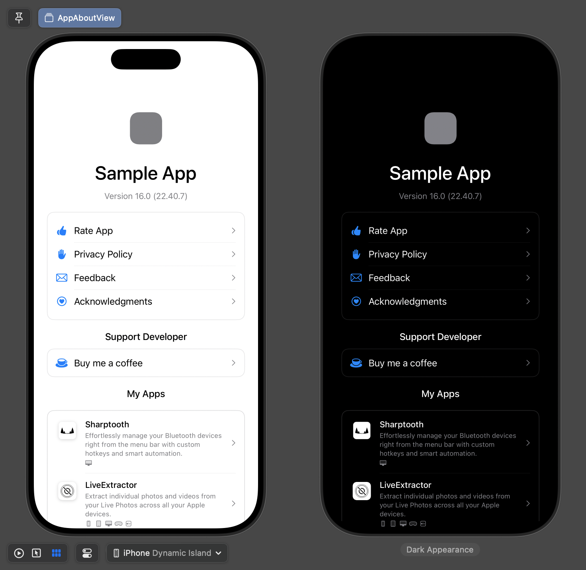

# AppAboutView

A comprehensive SwiftUI micro-framework for displaying beautiful "About" views in your macOS and iOS apps. Features automatic bundle detection, in-app purchases for coffee tips, app showcase functionality, and full localization support.



> ⚠️ **AI Development Notice**: This project was heavily developed using AI tools including [Claude Code](https://claude.ai/code) and [Windsurf](https://windsurf.com/refer?referral_code=bfc775d405). It brings potential legal and ethical concerns, so use it with caution and always review the generated code.


> "You’re not in control, Dolores. You’re just playing your part."
> -- Bernard Lowe, WestWorld S2E2

## Features

### Core Functionality

- **Multi-platform support** - Works on macOS 15+, iOS 17+, tvOS 17+, and visionOS 1+ with platform-specific UI adaptations
- **Automatic bundle info extraction** - Pulls app name, version, and build info from your app's bundle
- **Customizable actions** - Support for feedback email, App Store rating, privacy policy, and acknowledgments
- **Platform-specific styling** - Native look and feel on each platform with proper color schemes and layout

### Advanced Features

- **Coffee Tip Integration** - Built-in StoreKit support for in-app purchase coffee tips with customizable product IDs
- **App Showcase** - Display your other apps with local icons, platform tags, and smart filtering
- **Remote Data Loading** - Fetch app showcase data from remote URLs with intelligent caching (1-hour refresh)
- **Comprehensive Localization** - Full support for 10 languages (English, German, Spanish, French, Italian, Japanese, Korean, Russian, Simplified Chinese, Traditional Chinese)
- **Smart Caching** - UserDefaults-based caching with automatic refresh logic and debug mode override
- **Current App Filtering** - Automatically excludes the current app from the showcase list

## Installation

### Swift Package Manager

Add the following to your `Package.swift` file:

```swift
dependencies: [
    .package(url: "path/to/AppAboutView", from: "0.0.2")
]
```

Or add it through Xcode:

1. File → Add Package Dependencies
2. Enter the repository URL
3. Add to your target

## Usage

### Basic Usage

```swift
import AppAboutView

// Automatic bundle info detection with all features
AppAboutView.fromMainBundle(
    feedbackEmail: "feedback@yourapp.com",
    appStoreID: "123456789",
    privacyPolicy: URL(string: "https://yourapp.com/privacy"),
    copyrightText: "©2025 Your Company. All rights reserved.",
    appsShowcaseURL: URL(string: "https://yourapp.com/apps.json"),
    coffeeTips: ["coffee.single", "coffee.double", "coffee.triple"]
)
```

### Custom Configuration

```swift
AppAboutView(
    appName: "My Custom App",
    appIcon: Image("custom-icon"),
    appVersion: "2.0.0",
    buildVersion: "42",
    feedbackEmail: "support@myapp.com",
    appStoreID: "987654321",
    privacyPolicy: URL(string: "https://myapp.com/privacy"),
    copyrightText: "©2025 My Company Inc.",
    onAcknowledgments: { 
        // Handle acknowledgments button tap
        showAcknowledgments()
    },
    appsShowcaseURL: URL(string: "https://api.myapp.com/showcase.json"),
    coffeeTips: ["tip.small", "tip.medium", "tip.large"]
)
```

## Screenshots

See [Screenshots.md](Screenshots.md) for a comprehensive visual showcase of all AppAboutView configurations and features, including:

- **Complete feature demonstrations** - Every configuration from minimal to fully-featured setups
- **Light and dark mode comparisons** - Side-by-side appearance across all scenarios  
- **Multiple screen sizes** - iPhone SE, iPhone 8, iPhone 11 Pro Max, iPad, and custom aspect ratios
- **Platform-specific styling** - Native macOS and iOS appearances
- **Special cases** - Unicode text, long app names, and various edge cases

All screenshots are captured at retina resolution with proper backgrounds, making them perfect for documentation, App Store listings, and marketing materials.

### App Showcase Integration

The framework includes a sophisticated app showcase system that displays your other apps:

```swift
// Standalone showcase view
AppShowcaseView(
    remoteURL: URL(string: "https://yourapi.com/apps.json"),
    currentAppStoreID: "123456789" // Filters out current app
)
```

#### App Showcase Data Format

Create a JSON file with your app information:

```json
{
  "version": "1.0.0",
  "lastUpdated": "2025-08-03T00:00:00Z",
  "apps": [
    {
      "id": "myapp",
      "name": "My App",
      "briefDescription": {
        "en": "An amazing app for productivity",
        "zh-Hans": "提高生产力的惊人应用",
        "ja": "生産性を向上させる素晴らしいアプリ"
      },
      "appStoreID": "987654321",
      "platforms": ["macOS", "iOS", "iPadOS"]
    }
  ]
}
```

### Coffee Tips Setup

To enable in-app purchase coffee tips:

1. Set up your in-app purchase products in App Store Connect
2. Pass the product IDs to the `coffeeTips` parameter:

```swift
AppAboutView.fromMainBundle(
    // ... other parameters
    coffeeTips: ["com.yourapp.coffee1", "com.yourapp.coffee3", "com.yourapp.coffee5"]
)
```

The framework automatically handles:

- Product loading and purchasing via StoreKit
- Thank you alerts after successful purchases
- Graceful error handling
- Localized coffee tip button names ("Buy me a coffee", "Buy me 3 coffees", etc.)

### Localization

The framework includes comprehensive localization support:

- **Supported Languages**: English (base), German, Spanish, French, Italian, Japanese, Korean, Russian, Simplified Chinese, Traditional Chinese
- **Automatic Detection**: Uses device language settings with fallback to English
- **Custom App Data**: Support for localized app descriptions in showcase data
- **Bundle Integration**: All strings use `.module` bundle for proper SPM integration

### Platform Support

- **Supported Platforms**: macOS 15+, iOS 17+, tvOS 17+, visionOS 1+
- **Platform-Specific Features**:
  - iOS: In-app App Store integration for showcase apps
  - macOS: External App Store links, native color schemes
  - tvOS & visionOS: Optimized UI layouts and interactions
  - Adaptive UI elements and spacing across all platforms

## Architecture

### Core Components

- **AppAboutView**: Main SwiftUI view with platform-specific styling and StoreKit integration
- **AppShowcaseView**: Displays developer's other apps with platform tags and navigation
- **AppShowcaseService**: `@MainActor` service managing app data loading and caching
- **MyAppInfo**: Data models for app information with localization support

### Caching Strategy

- **Local Bundle**: Ships with apps.json for offline functionality
- **Remote Updates**: Fetches from provided URLs with 1-hour cache refresh
- **Debug Mode**: Always fetches fresh data during development
- **Fallback Logic**: Graceful degradation from remote → cached → local data

## Requirements

- macOS 15.0+ / iOS 17.0+ / tvOS 17.0+ / visionOS 1.0+
- Swift 6.0+
- SwiftUI
- StoreKit (for coffee tips feature)

## Testing

The framework includes a comprehensive test suite covering:

- **Component Tests**: Initialization and configuration validation
- **Data Model Tests**: JSON parsing and localization logic
- **Service Tests**: App showcase data loading and caching
- **UI Tests**: Screenshot testing for visual regression detection

Run tests with: `swift test`

## If you like this project

If you find AppAboutView useful, please consider checking out my other apps:

### 📱 [Sharptooth](https://apps.apple.com/app/id6748440814) (macOS)
Effortlessly manage your Bluetooth devices right from the menu bar with custom hotkeys and smart automation.

### 📸 [LiveExtractor](https://apps.apple.com/app/id6746672642) (iOS, macOS, tvOS, visionOS)
Extract individual photos and videos from your Live Photos across all your Apple devices.

### 🗂️ [SwiftyMenu](https://apps.apple.com/app/id1567748223) (macOS)
A Finder extension which presents a customizable menu to rapidly open selected folders or files with your favorite applications.

### 🔤 [RegEx+](https://apps.apple.com/app/id1511763524) (iOS, macOS)
An app to test your regular expressions with live matching.

## License

This project is available under the MIT license.
