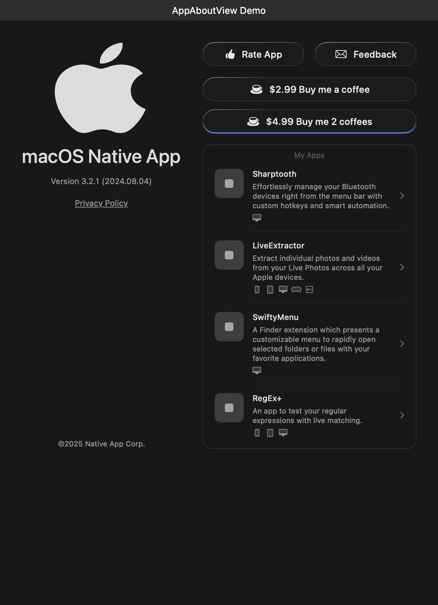
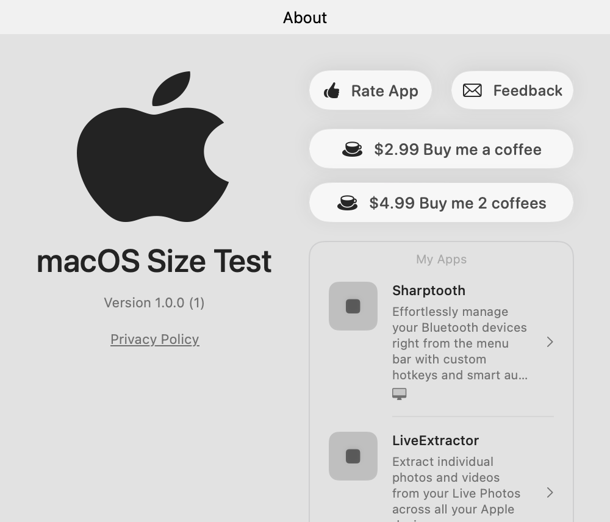
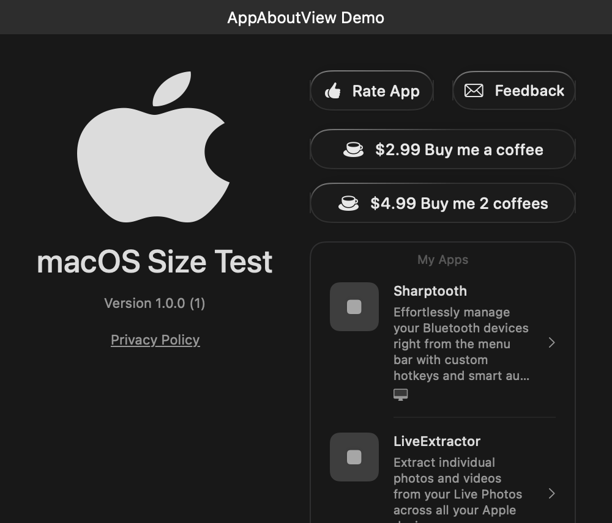
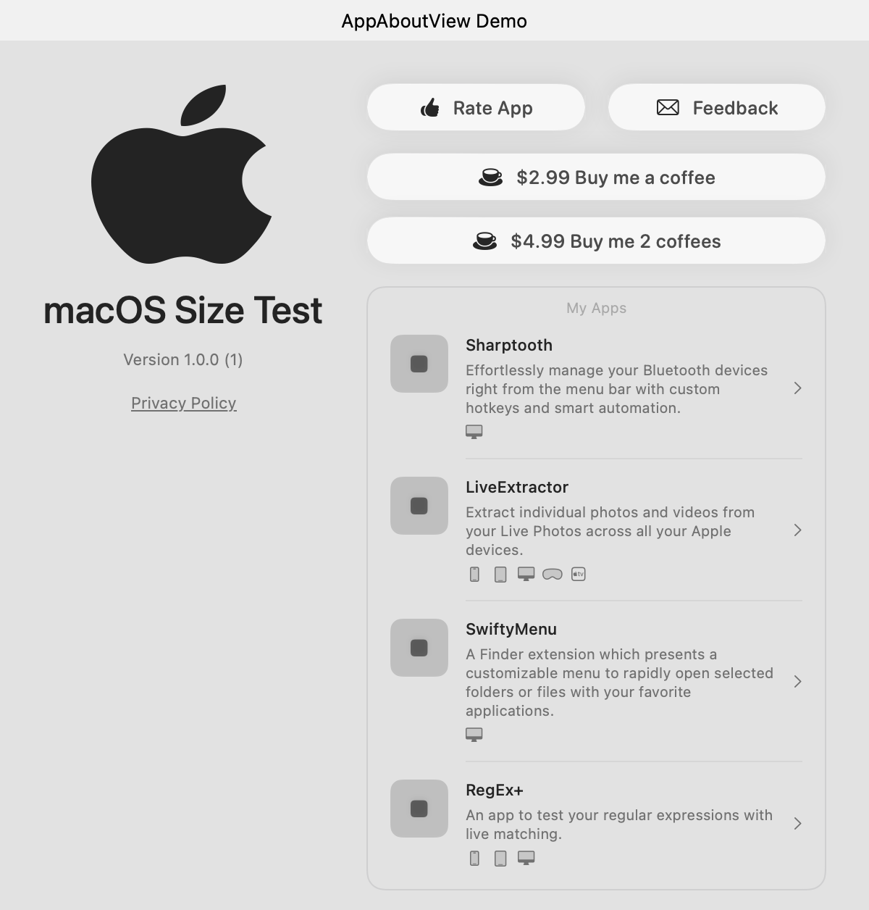
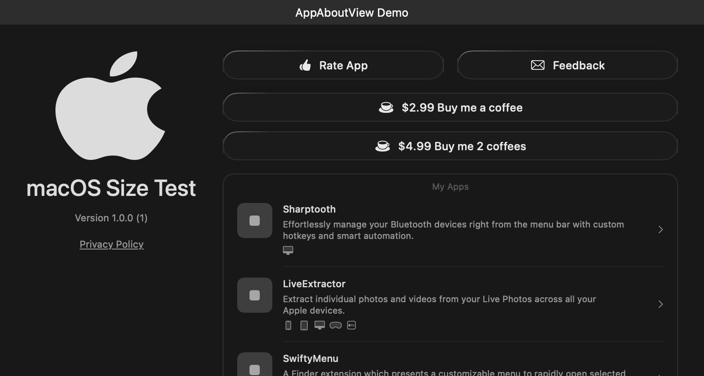

# AppAboutView Screenshots

This document showcases the macOS-specific configurations and window sizes of AppAboutView, displaying both light and dark mode appearances.

## Platform-Specific Styling

### macOS
Native macOS styling with platform-specific visual elements.

| Light Mode | Dark Mode |
|------------|-----------|
|  |  |

#### macOS Window Sizes
Different window sizes on macOS to demonstrate responsive layout.

##### Compact macOS Window (500×400)
| Light Mode | Dark Mode |
|------------|-----------|
|  |  |

##### Standard macOS Window (600×600)  
| Light Mode | Dark Mode |
|------------|-----------|
|  |  |

##### Wide macOS Window (800×400)
| Light Mode | Dark Mode |
|------------|-----------|
|  |  |

## Technical Details

- **Resolution**: All screenshots are captured at native retina resolution
- **Backgrounds**: Solid background for light mode (light gray), darker background for dark mode
- **Color Schemes**: Each configuration is tested with both `.light` and `.dark` SwiftUI color schemes
- **Platform**: Screenshots are generated on macOS using native AppKit with window frames and title bars
- **Automated Testing**: All screenshots are generated through Swift Testing framework ensuring consistency

## Screenshot Generation Process

The screenshots are automatically generated using Swift Testing framework:

### Test File Organization

- **`AppAboutViewScreenshotTests_macOS.swift`**: macOS-specific tests and window sizes (macOS-only)

### Test Process

Each test:

1. Creates a specific AppAboutView configuration
2. Renders it in both light and dark color schemes within an NSWindow
3. Applies appropriate background colors and native macOS window styling
4. Captures the rendered view as a PNG image at retina resolution including window frame and title bar
5. Saves the images to the `screenshots/` directory

### Running Tests

#### macOS Tests
- **macOS-specific tests**: `swift test --filter AppAboutViewScreenshotTests_macOS`
- **Requirements**: Run on macOS with AppKit

#### Platform Requirements
- **macOS tests** run only on macOS using native AppKit windows with title bars
- **Native window styling** including proper title bar rendering and window controls
- **Consistent output** - all screenshots save to the `screenshots/` directory

## Usage in Documentation

These screenshots can be used in:
- README.md documentation
- API documentation
- App Store listings
- Marketing materials
- Development guides

All images are optimized for display on both regular and retina displays, ensuring crisp presentation across all devices.