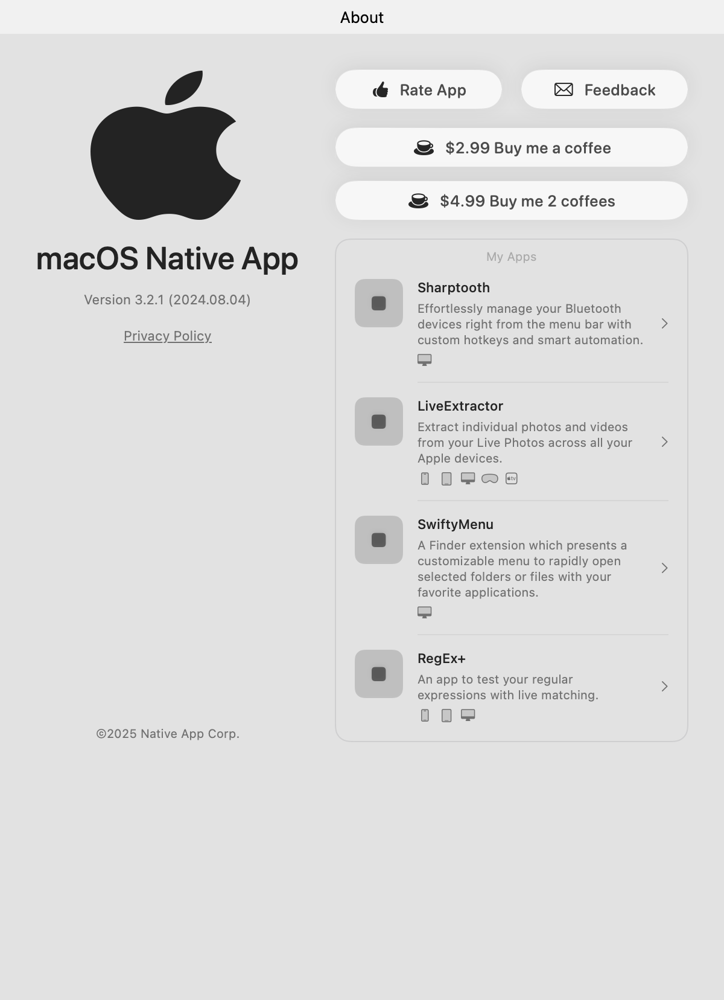

# AppAboutView Screenshots

This document showcases all the different configurations and scenarios of AppAboutView at their exact retina resolution, displaying both light and dark mode appearances side by side.

## Basic Configurations

### Minimal Configuration
The most basic setup with just an app name and App Store ID.

| Light Mode | Dark Mode |
|------------|-----------|
|  |  |

### Full Configuration  
All features enabled: privacy policy, feedback email, acknowledgments, coffee tips, and app showcase.

| Light Mode | Dark Mode |
|------------|-----------|
|  |  |

## Individual Features

### Coffee Tips Only
Shows how the component looks with just coffee tip support enabled.

| Light Mode | Dark Mode |
|------------|-----------|
|  |  |

### Single Coffee Tip
Demonstrates the layout when only one coffee tip option is provided.

| Light Mode | Dark Mode |
|------------|-----------|
|  |  |

### Empty Coffee Tips Array
Shows the component when coffee tips array is empty (coffee section is hidden).

| Light Mode | Dark Mode |
|------------|-----------|
|  |  |

### Privacy Policy Only
Component with only privacy policy link enabled.

| Light Mode | Dark Mode |
|------------|-----------|
|  |  |

### Feedback Email Only
Component with only feedback email functionality enabled.

| Light Mode | Dark Mode |
|------------|-----------|
|  |  |

### Acknowledgments Only
Component with only acknowledgments callback enabled.

| Light Mode | Dark Mode |
|------------|-----------|
|  |  |

## Special Cases

### Special Characters
Demonstrates proper handling of Unicode characters, special symbols, and international text.

| Light Mode | Dark Mode |
|------------|-----------|
|  |  |

### Long App Name
Shows text wrapping behavior with very long application names.

| Light Mode | Dark Mode |
|------------|-----------|
|  |  |

## Platform-Specific Styling

### macOS
Native macOS styling with platform-specific visual elements.

| Light Mode | Dark Mode |
|------------|-----------|
|  |  |

## Different Screen Sizes

### Compact (320×568) - iPhone SE
| Light Mode | Dark Mode |
|------------|-----------|
|  |  |

### Regular (375×667) - iPhone 8
| Light Mode | Dark Mode |
|------------|-----------|
|  |  |

### Large (414×896) - iPhone 11 Pro Max
| Light Mode | Dark Mode |
|------------|-----------|
|  |  |

### iPad (768×1024)
| Light Mode | Dark Mode |
|------------|-----------|
|  |  |

### Wide Aspect Ratio (600×400)
| Light Mode | Dark Mode |
|------------|-----------|
|  |  |

## Technical Details

- **Resolution**: All screenshots are captured at native retina resolution
- **Backgrounds**: Solid white background for light mode, solid black background for dark mode
- **Color Schemes**: Each configuration is tested with both `.light` and `.dark` SwiftUI color schemes
- **Platforms**: Screenshots are generated on macOS but demonstrate cross-platform compatibility
- **Automated Testing**: All screenshots are generated through Swift Testing framework ensuring consistency

## Screenshot Generation Process

The screenshots are automatically generated using the `AppAboutViewScreenshotTests` test suite. Each test:

1. Creates a specific AppAboutView configuration
2. Renders it in both light and dark color schemes
3. Applies appropriate background colors (white for light, black for dark)
4. Captures the rendered view as a PNG image at retina resolution
5. Saves the images to the `screenshots/` directory

This ensures all screenshots are consistent, up-to-date, and accurately represent the current state of the component.

## Usage in Documentation

These screenshots can be used in:
- README.md documentation
- API documentation
- App Store listings
- Marketing materials
- Development guides

All images are optimized for display on both regular and retina displays, ensuring crisp presentation across all devices.